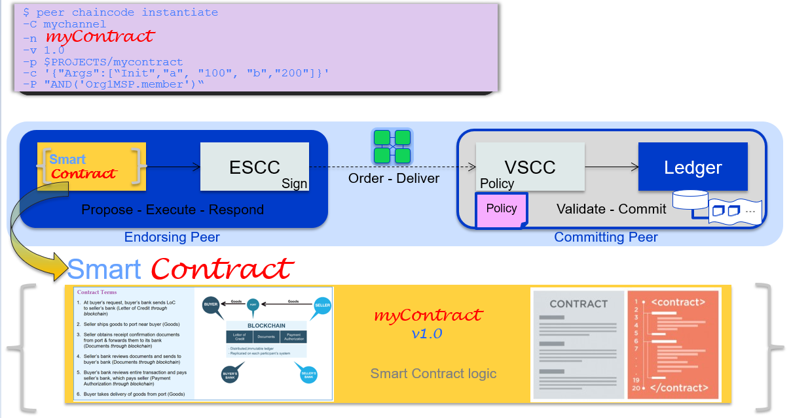

# Setting up and running a NodeJS Chaincode using the new Programming Model



This tutorial provides an End-to-End example of setting up, configuring and running a sample NodeJS chaincode, using the new {{site.data.conrefs.hlf_full}} programming model. The goal is to show a simple example of implementing Smart Contract chaincode using the new programming model. The tutorial is intended to be a full 'end-to-end' tutorial - it takes the developer from initial setup of a local Fabric 'dev' environment, to building, deploying and interacting with the smart contract, running on the blockchain. As part of this, we will show developing/testing a sample smart contract (chaincode) in 'Developer Mode' and in the appendix, provide instructions on standard deployment (no longer in 'developer mode') of the smart contract/chaincode to a 'remote' Fabric blockchain already configured. 


# Pre-requisites

- The new Fabric 1.3 `fabric-contract-apis` and `fabric-shim` dependencies in the `package.json` file for our chaincode example. 
- Docker and docker-compose installed - as part of this tutorial, you will pull the latest Fabric 1.3 docker images to set up your {{site.data.conrefs.hlf_full}}  environment.
- A {{site.data.conrefs.hlf_full}} Fabric 1.3 environment (dockerized images), configured for 'Chaincode dev mode' - this is a setting in a docker-compose YAML file - more on that later.
- multiple terminal windows
- a clone of this Fabric Samples Github repository from https://github.com/hyperledger/fabric-samples  - please note this repo has modifications to docker-compose YAML files and scripts to pull the {{site.data.conrefs.hlf_full}} 1.3 images mentioned earlier.
- Some sample code to use (provided as code blocks in this tutorial)


# A word about using Chaincode - Dev mode vs 'non-Dev' (deploy) mode

Normally chaincodes are started and maintained by peer. However in “dev mode”, chaincode is built and started by the user (developer). This mode is useful during chaincode development phase for rapid code/build/run/debug cycle turnaround.

{site.data.conrefs.hlf_full}} - in its `basic-network` configuration, downloaded as part of Fabric samples - provides a simple docker-compose YAML file to start a simple network, and it starts the peer in "dev mode". Note that it also starts two additional containers (one is for the chaincode container and the other is a CLI container, so as to interact with the chaincode itself). In the configuration (`docker-compose-simple.yml`) the Chaincode container has volume mapping in place, the `chaincode` directory under `fabric-samples` is mapped to /opt/gopath/src/chaincode in the chaincode container. 

To start out with, you can deposit the chaincode to the directory $GOPATH/src directory to test the chaincode. Once the chaincode is tested and the developer is satisfied it works, it can be later be deployed (via the CLI container) to a full Fabric enviroment,   by attaching as a volume to our chaincode container,  so that this chaincode (combined with the version of chaincode in particular) can be installed/deployed and initialised (instantiated) on a channel on the {site.data.conrefs.hlf_full} blockchain network.

# Download the Fabric Samples

1. Clone the Fabric Samples directory as follows, into your chosen directory:

git clone https://github.com/hyperledger/fabric-samples.git

2. cd fabric-samples ; git checkout master  # need 'master' branch for latest changes

3. Download the latest Fabric tools, inside the fabric-samples directory:

curl -sSl https://nexus.hyperledger.org/content/repositories/releases/org/hyperledger/fabric/hyperledger-fabric-1.3.0-stable/linux-amd64.1.3.0-stable-1b2d58c/hyperledger-fabric-1.3.0-stable-linux-amd64.1.3.0-stable-1b2d58c.tar.gz | tar zxvf -

4. Set the PATH as follows (replace <workingdir> with where you've downloaded the sames, eg in $HOME for example):

   export PATH=<currentworkingdir>/fabric-samples/bin:$PATH

# Download the correct Fabric Docker Images 
 
 The Fabric 1.3 docker images can be obtained from the Fabric Nexus docker repository: eg.
 
`https://nexus.hyperledger.org/content/repositories/releases/org/hyperledger/fabric/hyperledger-fabric-1.3.0-stable/`

ie find the latest images under this directory (datestamp on right) for the platform you want to download the images eg. Mac, Linux etc

1. For the peer image - do the following,  and tag the image with a new label to indicate its a 1.3 image:   

    `docker pull nexus3.hyperledger.org:10001/hyperledger/fabric-peer:amd64-1.3.0-stable-3139ec2` https://nexus.hyperledger.org/content/repositories/releases/org/hyperledger/fabric/hyperledger-fabric-1.3.0-stable/linux-amd64.1.3.0-stable-3139ec2/
    
    `docker tag nexus3.hyperledger.org:10001/hyperledger/fabric-peer:amd64-1.3.0-stable-1b2d58c hyperledger/fabric-peer:x86_64-1.3.0`

2. For the orderer image - do the following:

    `docker pull nexus3.hyperledger.org:10001/hyperledger/fabric-orderer:amd64-1.3.0-stable-3139ec2`
    
    `docker tag nexus3.hyperledger.org:10001/hyperledger/fabric-orderer:amd64-1.3.0-stable-3139ec2 hyperledger/fabric-orderer:x86_64-1.3.0`

3. For the Fabric base image - do the following: NOT NEEDED - Paul

    `docker pull nexus3.hyperledger.org:10001/hyperledger/fabric-baseimage:amd64-1.3.0-stable-3139ec2`
    
    `docker tag nexus3.hyperledger.org:10001/hyperledger/fabric-baseimage:amd64-1.3.0-stable-3139ec2 hyperledger/fabric-baseimage:x86_64-1.3.0`

4. For fabric tools, CLI - do the following:

   `docker pull nexus3.hyperledger.org:10001/hyperledger/fabric-tools:amd64-1.3.0-stable-3139ec2`
   
   `docker tag nexus3.hyperledger.org:10001/hyperledger/fabric-tools:amd64-1.3.0-stable-3139ec2 hyperledger/fabric-tools:x86_64-1.3.0`
   
5. For Fabric ccenv - do the following:

   `docker pull nexus3.hyperledger.org:10001/hyperledger/fabric-ccenv:amd64-1.3.0-stable-3139ec2`
   
   `docker tag nexus3.hyperledger.org:10001/hyperledger/fabric-ccenv:amd64-1.3.0-stable-3139ec2c hyperledger/fabric-ccenv:x86_64-1.3.0`


# Setup your Development environment

1. First, change directory to the Fabric chaincode dev environment inside your `fabric-samples` directory that was cloned earlier:

    `cd chaincode-docker-devmode`
    
2. Copy the file `docker-compose-simple.yaml` from this repository: https://github.com/mahoney1/newprogmodel/  into this directory, overwriting the current `docker-compose-simple.yaml` file

3. Run the following command, to clear down old docker containers or images:

`docker-compose -f docker-compose-simple.yaml down`  # clear down any old environment

4.  `docker ps -a ` to ensure you have no lingering containers  - if you do, stop them and remove them using `docker stop <container id> ` and `docker rm <container_id>

5. Now start the new Dev mode environment:

     `docker-compose -f docker-compose-simple.yaml up` 

Your chaincode development environment should now be up and running.

# Create a sample chaincode using the new programming model

1. Make a directory called `mycontract` in the current directory and `cd` into it.

   `cd updatevalues`

2. Copy the file `updatevalues.js`, `package.json`, `index.js`  from this repository: https://github.com/mahoney1/newprogmodel/  into this directory - you can simply clone it to `/tmp` and copy the files into the current chaincode dev directory eg.

    `git clone https://github.com/mahoney1/newprogmodel/ /tmp ; cp /tmp/newprogmodel/* . `

The index.js file contains the definition of where the smart contract logic is defined  (see more about the Smart Contract APIs [here](https://www.npmjs.com/package/fabric-contract-api) - and review this for a moment - it provides the 'basic ingredients' for a our smart contract NodeJS implementation and `requires` the contract logic `updatevalues.js` to be included.

   ```
     // index.js
     'use strict';


      const UpdateValues = require('./updatevalues.js')

      module.exports.contracts = ['UpdateValuesContract'];
   ```

3. Next, open the javascript file `updatevalues.js` and check for the presence of the requisite `Init` and `Invoke` functions. The Fabric chaincode interface requires these functions (methods) to be present. In particular, the `Init` method is called when a chaincode receives an instantiate (or indeed an upgrade transaction), so that the chaincode may perform any necessary initialization, such as initialization of an application state. The `Invoke` method is called in response to receiving a chaincode invoke transaction to process transaction proposals, eg. updating/creating an asset's state or specific attributes of an asset, as part of a transaction.

Note that ALL the other functions defined in this JS script is executed as chaincode, and can be called/invoked by the Fabric client SDK.

The class implemented is called UpdateValuesContract (as matched in the module.exports of the index.js file) that extends the superclass `Contract`, with a namespace of `org.mynamespace.updates`
There are 3 functions setup: `InitContract`, `transactionA` and `transactionB` that are intended to be invokedi from the client side (via an invoke sequence). 

The `ctx` parameter (and reference object) in the function is a transaction context; each time a invoke is called, a new instance is created, that can be used by the function implementation, to access the native Fabric APIs, to perform transactions or queries etc.

The arguments (`args`) is an array, passed on with the invoke.

The constructor contains a 'namespace' to help identify the sets of functions, from the client side.

A more detailed description of these can be found at https://mbwhite.github.io/tutorial-using-contractinterface.html (need to replace with final URL etc - Paul)

4. Finally, open the `package.json` and examine some of the key information (extract shown below):

```
    "name": "my sample contract",
    "version": "0.0.1",
    "description": "Smart Contract Sample - mycontract",
    "engines": {
        "node": ">=8",
        "npm": ">=5"
    },
    "main": "updatevalues.js",
    "scripts": {
        "lint": "eslint .",
        "pretest": "npm run lint",
        "test": "nyc mocha --recursive",
        "start": "startChaincode"
    },
    "engineStrict": true,
    "author": "Paul O",
    "license": "Apache-2.0",
    "dependencies": {
        "fabric-contract-api": "fabric-contract-api-1.3.0-snapshot",
        "fabric-shim": "fabric-shim-1.3.0-snapshot"```

```

The important pieces are the `dependencies` section, requiring the `fabric-contract-api` (new in 1.3) and the `fabric-shim` (standard chaincode APIs) for the application. The start sequence should be called `startChaincode`.

Lastly, the sample code has some debug messages (implemented with `console.log`) so that we can see the chaincode messages interactively, when running the chaincode.

5. Next, let's install our dependencies listed in `package.json`, so that we can run the chaincode:

    `npm install`

6. Now we're ready to start up our chaincode, by accessing the CLI container, and directory where the smart contract is located, using the following commands from the `chaincodedev` directory, as accessed from the CLI container below:

    ```
       docker exec -it cli bash
       
       cd mycontract

       CORE_CHAINCODE_ID_NAME="mycontract:v0" node updatevalues.js --peer.address grpc://peer:7052
       
    ```
     
   Your node application should be running in the current window, with some messages, but waiting for activity eg.
   
    <date> INFO [lib/handler.js] Successfully registered with peer node. State transferred to "established" 
    <date> INFO [lib/handler.js] Successfully established communication with peer node. State transferred to "ready"
     
7. Open another terminal and launch the CLI again, and once again, from the `chaincode-docker-devmode` directory, run the following command:

        ```
       
       CORE_PEER_ADDRESS=peer:7051 peer chaincode install -l node -n mycontract -v v0 -p mycontract
       
       ```

    This installs the chaincode package on the peer (via the shared docker volume with the CLI container) - you should see a message response:
    
    `Installed remotely response:<status:200 payload:"OK" >`


8. Next, we need to instantiate the chaincode on the channel, using the following command (it requires the namespace prefix, with no arguments supplied to the `Init` below):

       CORE_PEER_ADDRESS=peer:7051 peer chaincode instantiate -o orderer:7050 -C myc -l node -n mycontract -v v0 -c '{"Args":["org.mynamespace.updates_Init",""]}' 
    
  This can take a little time to instantiate on the channel, please note. After some 60s or so, you will see messages about the sample running chaincode being instantiated on the channel. Eg.
  
     =========== Instantiated Sample chaincode ===========
     <date> INFO [lib/handler.js] [myc-f09903a1]Calling chaincode Init() succeeded. Sending COMPLETED message back to peer
   
9. From the same CLI terminal, invoke the first Smart Contract function we've implemented, called `Init_Contract` - which creates a simple asset/key value in the world state as follows:

      CORE_PEER_ADDRESS=peer:7051 peer chaincode invoke --orderer orderer:7050 --channelID myc -c '{"Args":["InitContract","A1","10"]}' -n mycontract

Back on the running chaincode window, you should get some console messages about the key `A1` being initialised in the world state eg.
    
    FQ Function called is : InitContract was found with params A1,10

10. Next, invoke the following next two Smart Contract transactions in succession, and observe the console logged messages on the running chaincode window in the other terminal:

    `CORE_PEER_ADDRESS=peer:7051 peer chaincode invoke --orderer orderer:7050 --channelID myc -c '{"Args":["transactionA","A1","30"]}' -n mycontract`

Back on the running chaincode window, you should get some console messages about the result of `transactionA` being invoked.
    
    `CORE_PEER_ADDRESS=peer:7051 peer chaincode invoke --orderer orderer:7050 --channelID myc -c '{"Args":["transactionB","A1","103"]}' -n mycontract`
    
Once more, observe the messages in the running chaincode window, this time concerning `transactionB`


<h2 class='everybody'>Conclusion</h2>

In this tutorial, you'll have seen how to get going with the new Fabric 1.3 programming model, through a very simple example. As part of this, you have implemented the new `Contract` smart contract API and interacted with the blockchain, performing very simple transactions. The appendix provides more detail on transitioning from Chaincode 'dev' mode, to standing up a full Fabric environment and installing chaincode onto a fully-fledged blockchain network.

We hope you found the tutorial useful :-) - thanks for completing it !


<h2 class='everybody'>Appendix - Setting up a deployable Fabric environments</h2>

1. In addition to the Fabric environment you deployed for `chaincode dev mode` earlier, you will need to download two additional images - the easiest way to do this is to copy the docker-compose yaml file below, and (ensuring you keep your chaincode src backed up to a safe place initially), tear down the chaincode dev environment Fabric (from earlier) and start up a 'fresh' Fabric environment, with the addition of the docker container instances for the CA server and CouchDB as the world state DB (so that rich queries can be performed). Go to the simple-network directory and type:
       ./startFabric.sh

2. Do a `docker ps` and ensure you see running containers for the fabric-tools, fabric-peer, fabric-orderer, fabric-ca, and fabric-couchdb
